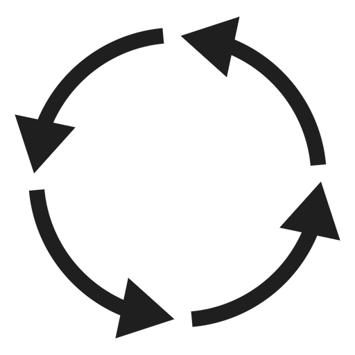
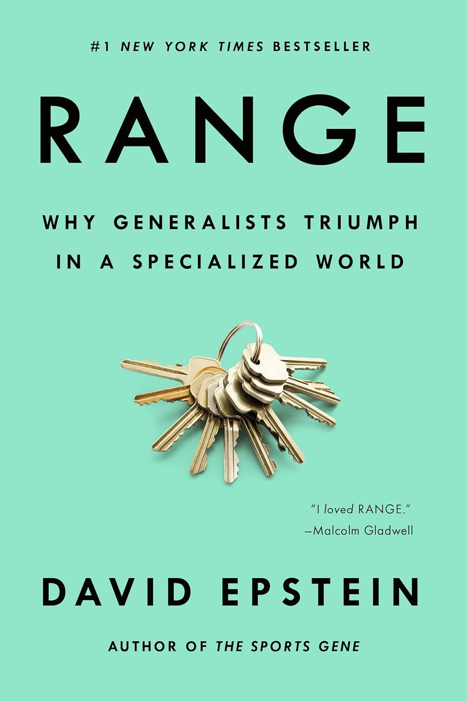

# Refactoring Your Identity

### Chris Ayers

---

## Chris Ayers

_Principal Software Engineer_  
_Azure CXP AzRel_  
_Microsoft_

<i class="fa-brands fa-bluesky"></i> BlueSky: [@chris-ayers.com](https://bsky.app/profile/chris-ayers.com)
<i class="fa-brands fa-linkedin"></i> LinkedIn: [chris\-l\-ayers](https://linkedin.com/in/chris-l-ayers/)
<i class="fa fa-window-maximize"></i> Blog: [https://chris-ayers\.com/](https://chris-ayers.com/)
<i class="fa-brands fa-github"></i> GitHub: [Codebytes](https://github.com/codebytes)
<i class="fa-brands fa-mastodon"></i> Mastodon: [@Chrisayers@hachyderm.io](https://hachyderm.io/@Chrisayers)
~~<i class="fa-brands fa-twitter"></i> Twitter: @Chris_L_Ayers~~

---

# <!-- fit --> Who are you?
<!-- Speaker Note: Prompt introspection; encourage audience to reflect beyond job title or current stack. This question seeds later reframing. -->

---

# <!-- fit --> How do you define your technical identity?
<!-- Speaker Note: Challenge assumption that identity equals tools; push toward underlying transferable patterns and behaviors. -->

---

# <!-- fit --> Does it include a stack or tool?
<!-- Speaker Note: Surface common pitfall—over-indexing on frameworks. Encourage noticing emotional attachment to tech labels. -->

---

# <i class="fa-solid fa-lightbulb" aria-hidden="true"></i> This matters because it could be a problem.

* Is your identity tied too closely to tools or stacks?
* Does new technology feel uncomfortable or risky?
* Do you solve all problems with the same approach?
<!-- Speaker Note: Highlight risks of narrow pattern application—reduced adaptability and cognitive rigidity. Normalize discomfort with new tech. -->

---

# 🧵 Story Time

## Coding Kata Meetup 😅🧑‍💻

> I'm not a ____________ developer. I'm a .NET Developer.

_Identity over exploration._

<!-- Speaker Note: Anecdote illustrating choosing identity reinforcement over learning. Humanize the pattern—everyone does this. -->

---

# <i class="fa-solid fa-seedling" aria-hidden="true"></i> Or an Opportunity

* You have skills that can transfer across domains
* You keep curious and explore new technologies and approaches
* You document decisions and processes
* Being adaptable makes you durable

<!-- Speaker Note: Reframe from fear to leverage—transferable meta-skills compound. Documentation acts as an externalized memory enabling growth. -->

---

# <i class="fa-solid fa-user-gear" aria-hidden="true"></i> How did we get here?
<!-- Speaker Note: Transition to origin—identity forms through reinforcement loops. Invite reflection on career inertia. -->

---

# <i class="fa-solid fa-circle-nodes" aria-hidden="true"></i> How Technical Identity Forms

* There are early wins
* You gain speed & receive praise
* Requests start to funnel back to **"The Expert"**
* Repetition deepens your comfort but narrows your scope
<!-- Speaker Note: Positive feedback shapes specialization; celebrate growth but warn of narrowing exploration bandwidth. -->

---

# Deconstructing That Moment

* What belief was I protecting? ("I'm a .NET Developer.")
* What experiment did I avoid in that moment?
* What signal did I send to myself and others?
<!-- Speaker Note: Make the story actionable—help audience map this pattern to their own moments of choosing identity over exploration. -->

---

# <i class="fa-solid fa-stethoscope" aria-hidden="true"></i> Identity Warning Signs

* Lead introductions with tool or framework
* Default to familiar tools before gathering requirements or options
* Avoid areas where you might lack skill
<!-- Speaker Note: Encourage self-audit; these behaviors indicate comfort-preservation mode. Ask audience to note which resonates. -->

---

# <i class="fa-solid fa-clipboard-list" aria-hidden="true"></i> Identity Reflection Exercise

* List 3 tech areas you reflexively avoid

* Note the last time you shipped in an unfamiliar stack

* Identify a decision you biased toward comfort

* What fear drove it? (status / time / exposure)
<!-- Speaker Note: Actionable reflection—convert vague discomfort into explicit inventory. Fear labeling reduces its silent influence. -->

---

# Share & Normalize (Optional)

* Does anyone want to share **one** reflexive avoidance area
* Listen for patterns, not prescriptions or fixes
* Capture one small experiment you'd be willing to try next

<!-- Speaker Note: Light social commitment—normalize these patterns and convert reflection into a tiny, realistic next step. Skip or shorten if time is tight. -->

---

# <!-- fit --> Refactor Your Career Potential 
# *Before* Your Identity Hardens
<!-- Speaker Note: Create urgency—early diversification is cheaper. Identity ossifies over time; preempt lock-in now. -->

---

# <i class="fa-solid fa-scale-balanced" aria-hidden="true"></i> Costs & Risks Of a Narrow Identity
<!-- Speaker Note: Frame upcoming risk taxonomy—makes abstract downsides concrete to motivate change. -->

---

# <i class="fa-solid fa-lock" aria-hidden="true"></i> Identity Lock-In Costs

* Doing the same thing reduces exposure to new domains
* Comfort pick hardens into the default (silently narrowing options)
* Curiosity and Exploration muscles atrophy
<!-- Speaker Note: Emphasize atrophy metaphor—unused curiosity fades. Silent defaults shape future decisions unnoticed. -->

---

# <i class="fa-solid fa-chart-line" aria-hidden="true"></i> Compounding Opportunity Loss

* Delayed exposure to new paradigms
* Few trade-off decisions captured
* Little cross-stack horizon scanning & tech scouting
<!-- Speaker Note: Missed paradigms delay pattern recognition; lack of decision artifacts erodes leverage. Opportunity cost is invisible. -->

---

# <i class="fa-solid fa-shield-halved" aria-hidden="true"></i> Career Longevity Risks

* Scope growth can stall with too much maintenance, little new paradigms
* Judgment stays invisible with no documented rationale
* Adaptation debt compounds with fewer early paradigm reps
<!-- Speaker Note: Longevity requires visible judgment and adaptation reps. Without artifacts, promotable value stays hidden. -->

---

# <i class="fa-solid fa-battery-quarter" aria-hidden="true"></i> Energy & Motivation Risks

* Energy drains defending a niche instead of exploring
* Micro decisions go un-logged; progress feels invisible
* Continuous output without reflection stalls learning
<!-- Speaker Note: Emotional burnout from defending turf. Logging tiny wins restores momentum and learning velocity. -->

---

# <i class="fa-solid fa-robot" aria-hidden="true"></i> AI Displacement Risks

* AI can implement standard patterns quickly
* AI will implement what is asked, not what is needed
* AI lacks your contextual judgment and creativity
<!-- Speaker Note: Differentiator is judgment, not syntax. Strengthen interpretation and framing to stay irreplaceable. -->

---

# 🧵 Story Time

## Team Re-Org 🔄🧩🤝💭

_Identity over role._ Lock-In 🔐 vs Growth 🌱
<!-- Speaker Note: Re-org story—identity rigidity increases transition friction. Flexibility accelerates integration. -->

---

# <!-- fit --> Refactor Your Identity *Intentionally*
<!-- Speaker Note: Intent beats accidental drift; design identity evolution like roadmap iterations. -->

---

# <i class="fa-solid fa-fingerprint" aria-hidden="true"></i> Behavioral Patterns & Triggers
### Recognizing the Reflexes Before Changing Them
<!-- Speaker Note: Awareness precedes refactor—identify trigger moments to insert alternative responses. -->

---

# <i class="fa-solid fa-bolt" aria-hidden="true"></i> Comfort Zone Triggers

* Fluency drop and
* Perceived speed loss
* "Paradigm remap tax" - extra cognitive load need for mapping new concepts
<!-- Speaker Note: Name the sensations—slower feeling and cognitive strain are signals of growth, not failure. -->

---

# <i class="fa-solid fa-lightbulb" aria-hidden="true"></i> Framing & Clarity Triggers

* Ambiguous spec anxiety—feeling stuck because goals or specs aren’t clear
* Tool-first reflex—reaching for a favorite framework before knowing the problem
<!-- Speaker Note: Ambiguity often drives premature tool selection. Encourage pausing to clarify problem framing first. -->

---

# <i class="fa-solid fa-triangle-exclamation" aria-hidden="true"></i> Quality & Risk Defer Triggers

* Non-functional requirements deferred until late in project
* Legacy patterns forced into a mismatched context
<!-- Speaker Note: Deferral pattern signals comfort bias. Surfacing quality constraints early expands solution space. -->

---

# Micro-Interventions at the Moment of Choice

* Insert a 2-minute "options scan" before picking tools
* What has changed since last decision?
* Ask: "What’s the smallest experiment I can run here?"
* Capture one decision in 5 lines after key meetings
<!-- Speaker Note: Translate trigger awareness into tiny, repeatable behaviors that shift identity from fixed to experimental. -->

---

# <!-- fit --> Refactor Your Identity *For Growth*
<!-- Speaker Note: Shift focus to portable leverage—invest in cross-stack assets that survive tool churn. -->

---

# <i class="fa-solid fa-layer-group" aria-hidden="true"></i> Portable Skills
## That Compound Across Stacks
<!-- Speaker Note: Introduce compounding concept—skills here generate multiplicative returns across environments. -->

---

# Range & Generalists

- David Epstein’s *Range* argues that generalists thrive in complex, changing domains
- Breadth of experience + pattern-matching beats hyper-specialization in many careers
- Portable skills are how you build **useful range** without burning everything down
<!-- Speaker Note: Connect the talk to *Range*: reinforce that broad, transferable skills and experimentation across contexts create long-term advantage, especially as tools and stacks churn. -->

---

# <i class="fa-solid fa-diagram-project" aria-hidden="true"></i> Systems Design

- Identify boundaries & contexts
- Identify actors & contract definitions (inputs / outputs / rate limits)
- Understand data flows
- Architecture Decision Records (ADRs)
<!-- Speaker Note: Stress modeling and explicit contracts—these abstractions unlock stack transitions with minimal friction. -->

---

# Systems Design in Any Stack

- Same boundaries, different frameworks
- Same contracts, different protocols
- Same failure modes, different mitigations
<!-- Speaker Note: Make portability explicit—systems thinking survives tool churn and enables faster adoption of new stacks. -->

---

# <i class="fa-solid fa-triangle-exclamation" aria-hidden="true"></i> Business Value

- Understand customer and business value
- Align solutions to measurable outcomes
- Prioritize work based on impact and effort
<!-- Speaker Note: Anchor technical decisions in value; outcome fluency differentiates senior progression. -->

---

# <i class="fa-solid fa-scale-unbalanced" aria-hidden="true"></i> Trade-Offs

- Weigh options against constraints
- Consider long-term implications and trade-offs
- Evaluate reversibility and adaptability
<!-- Speaker Note: Teach reversible vs irreversible decisions—reduces paralysis and increases strategic velocity. -->

---

# <i class="fa-solid fa-puzzle-piece" aria-hidden="true"></i> Structured Problem Solving & Decision Artifacts

- Structured reframing
- Root cause analysis
- Failure mode analysis
<!-- Speaker Note: Artifact creation externalizes reasoning—amplifies judgment visibility and mentoring impact. -->

---

# <i class="fa-solid fa-bug-slash" aria-hidden="true"></i> Debugging Discipline

- Hypothesis-driven investigation
- Trace-based failure analysis
- Smallest isolating disproof experiment
- Bug Reproduction strategy
<!-- Speaker Note: Emphasize scientific method—tight feedback loops reduce time-to-insight and build trust. -->

---

# <i class="fa-solid fa-comments" aria-hidden="true"></i> Communication & Facilitation Levers

- Good at diagramming
- Effective meeting facilitation
- Clear written communication
- Active listening and empathy
<!-- Speaker Note: Communication multiplies technical impact—diagrams and facilitation accelerate shared clarity. -->

---

# High-Leverage Communication Patterns

- "What I’m hearing is…" to surface and align assumptions
- "Options, constraints, recommendation" format for proposals
- Visual first, words second for complex flows
<!-- Speaker Note: Provide reusable scripts that immediately raise perceived judgment and leadership, regardless of stack. -->

---

# <i class="fa-solid fa-sitemap" aria-hidden="true"></i> Cross-Cutting Quality & Governance

- Delivery automation & DORA signals
- Shift-left security & least privilege
- Layered observability
<!-- Speaker Note: Governance fluency elevates scope—shows readiness for broader system stewardship beyond code. -->

---

# <i class="fa-solid fa-user-group" aria-hidden="true"></i> Mentorship and Leadership

- Foster a culture of learning and growth
- Provide guidance and support to team members
- Encourage knowledge sharing and collaboration
<!-- Speaker Note: Leadership emerges through enabling others—identity expands when you scale your patterns via people. -->

---

# Connecting the Pillars: Judgment

- Systems design + business value → visible judgment
- You design **for** specific outcomes, not just elegant diagrams
- Your trade-offs are expressed in customer and business language
- Leaders can see how you turn constraints into deliberate choices
<!-- Speaker Note: Show how pairing architecture thinking with value fluency makes judgment legible and promotable—people can point to your decisions, not just your delivery. -->

---

# Connecting the Pillars: Problem Solving

- Trade-offs + debugging → trusted problem solver
- You can explain **why** you chose a path when things break
- Your debugging is faster because you remember the constraints you optimized for
- Teams call you in when stakes are high, not just when syntax is hard
<!-- Speaker Note: Emphasize that deliberate trade-off calls plus strong debugging discipline build deep trust under pressure—people feel safer shipping when you’re in the loop. -->

---

# Connecting the Pillars: Impact

- Communication + mentorship → force multiplier
- Your diagrams and narratives let others reuse your thinking without you
- People around you level up faster because you teach **how** you decide
- Your identity shifts from “the expert who does” to “the person who grows experts”
<!-- Speaker Note: Highlight that clear communication plus mentorship scales your patterns through others—this is where identity shifts from individual contributor to multiplier and becomes resilient to stack changes. -->

---

# <!-- fit --> Refactor Your Identity *Continuously*
<!-- Speaker Note: Reinforce cadence—identity work is a recurring practice, not an annual overhaul. -->

---

# <i class="fa-solid fa-brain" aria-hidden="true"></i> Adapting to Change and a Growth Mindset
* Treat discomfort as a signal, not a stop sign
* Measure progress by experiments run, not perfection
* Narrate your own reframes: "*I don’t know this… yet.*"
* *Yes, and…* your identity is a work in progress
<!-- Speaker Note: Ground growth mindset in concrete practices that align with earlier triggers and micro-interventions. -->

---

# From Concept to Practice

* You don’t need a full career rebrand
* You do need small, repeated reps that compound into identity
* Let’s start with 30 days of tiny, deliberate moves
<!-- Speaker Note: Bridge from ideas to action—set up the 30/60-day focus as structured, low-friction practice. -->

---

# Start Where You Are

* You don't have to quit your current job; shift **how** you practice inside and outside it
* Borrow problems from your team, community, or open source to experiment on
* Use meetups, conferences, and online groups as low-risk sandboxes
<!-- Speaker Note: Explicitly remove "burn it all down" pressure. Emphasize starting from today’s role and constraints, using community and side experiments instead of dramatic exits. -->

---

# <i class="fa-solid fa-calendar-day" aria-hidden="true"></i> 30-Day Focus (Skill Awareness & Leverage)

| Action Item         | Description |
| ------------------- | ----------- |
| <i class="fa-solid fa-magnifying-glass-chart" aria-hidden="true"></i> Skill Inventory | List 3 current strengths + 1 growth target you can practice. |
| <i class="fa-solid fa-file-circle-plus" aria-hidden="true"></i> Judgment Amplification | Create one decision record: context, options, criteria, rejected option, outcome (work or community). |
| <i class="fa-solid fa-handshake-simple" aria-hidden="true"></i> Communication Lift | Run assumption surfacing in one meeting, 1:1, or study group. |
| <i class="fa-solid fa-seedling" aria-hidden="true"></i> Adaptation Loop | Thin experiment: new tool, language, or domain at home + 5-line synthesis. |
<!-- Speaker Note: Short sprint—build awareness, produce one artifact, run one facilitation, and synthesize learning for compounding. -->

---

# <i class="fa-solid fa-calendar-week" aria-hidden="true"></i> 60-Day Focus (Application & Diffusion)
| Action Item | Description |
| ----------- | ----------- |
| <i class="fa-solid fa-scale-balanced" aria-hidden="true"></i> Balance Audit | Review last 30 tagged artifacts; find an underused pillar to practice in your current role or community. |
| <i class="fa-solid fa-diagram-project" aria-hidden="true"></i> Cross-Pillar Artifact | Create one option comparison (work task, OSS issue, or meetup talk) combining: constraints (Judgment) + surfaced assumptions (Communication) + experiment plan (Adaptation). |
| <i class="fa-solid fa-user-graduate" aria-hidden="true"></i> Mentorship Micro-Teach | 10‑min share of a leveraged skill at work, a meetup, or online; capture 2 follow-up questions. |
| <i class="fa-solid fa-clipboard-list" aria-hidden="true"></i> Weekly Synthesis | Consolidate top 3 leverage moments (skill applied → impact) from job, home projects, or community. |
<!-- Speaker Note: Second cycle diffuses skill—combine pillars, teach others, and audit balance to avoid drift. -->

---

# <!-- fit --> Refactor Your Identity *Continuously*
# Not Reactively
<!-- Speaker Note: Contrast proactive vs reactive—continuous identity work prevents crisis pivots under external pressure. -->

---

# Thank You

# Refactor Your Identity *Continuously*
## Not Reactively

## Follow Chris Ayers

<!-- Speaker Note: Close with reinforcement and call to action—invite one small experiment this week and artifact creation. Thank audience & open for questions. -->