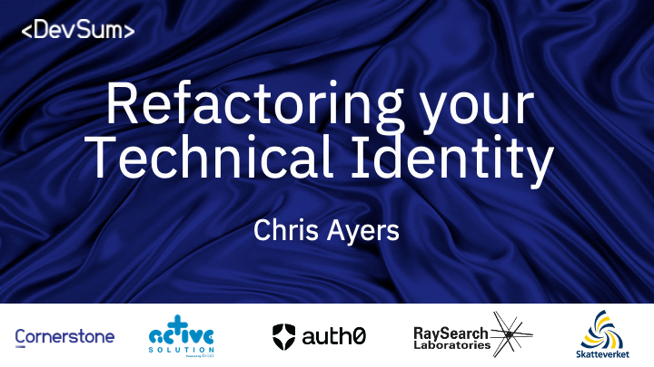
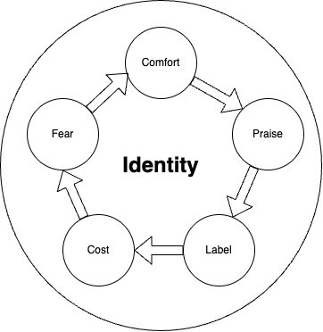
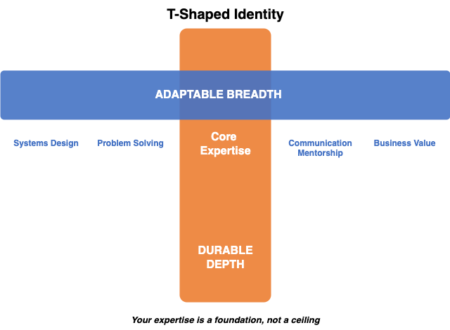
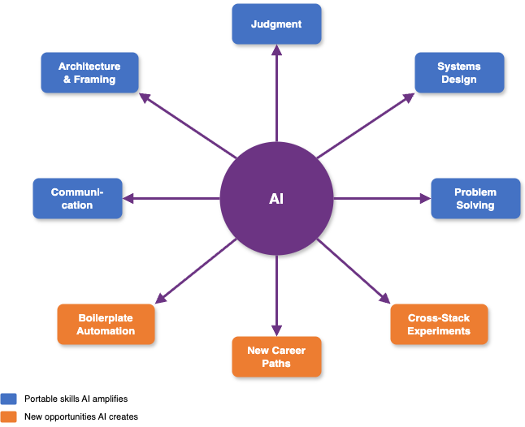
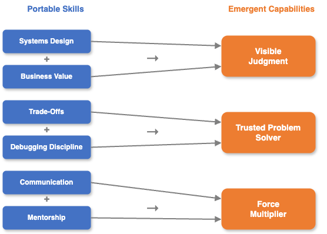
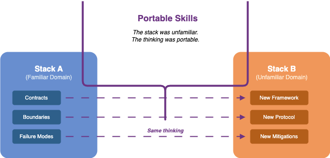

<!-- _footer: '' --->

---

# Refactoring Your Identity

### Chris Ayers

---

## Chris Ayers

_Principal Software Engineer_  
_Azure EngOps AzRel_  
_Microsoft_

<i class="fa-brands fa-bluesky"></i> BlueSky: [@chris-ayers.com](https://bsky.app/profile/chris-ayers.com)
<i class="fa-brands fa-linkedin"></i> LinkedIn: [chris\-l\-ayers](https://linkedin.com/in/chris-l-ayers/)
<i class="fa fa-window-maximize"></i> Blog: [https://chris-ayers\.com/](https://chris-ayers.com/)
<i class="fa-brands fa-github"></i> GitHub: [Codebytes](https://github.com/codebytes)
<i class="fa-brands fa-mastodon"></i> Mastodon: [@Chrisayers@hachyderm.io](https://hachyderm.io/@Chrisayers)
~~<i class="fa-brands fa-twitter"></i> Twitter: @Chris_L_Ayers~~

---

<!-- _class: invert -->

# <!-- fit --> Who are you?
<!-- Speaker Note: Prompt introspection; encourage audience to reflect beyond job title or current stack. This question seeds later reframing. -->

---

# <!-- fit --> How do you define your technical identity?
<!-- Speaker Note: Challenge assumption that identity equals tools; push toward underlying transferable patterns and behaviors. -->

---

# <!-- fit --> Does it include a stack or tool or specific technology?
<!-- Speaker Note: Surface common pitfall—over-indexing on frameworks. Encourage noticing emotional attachment to tech labels. -->

---

# <i class="fa-solid fa-lightbulb" aria-hidden="true"></i> This matters because it could be a problem.

* Is your identity tied too closely to tools, stacks, or a specific technology?
* Does new technology feel uncomfortable or risky?
* Do you solve all problems with the same approach?
<!-- Speaker Note: Highlight risks of narrow pattern application—reduced adaptability and cognitive rigidity. Normalize discomfort with new tech. -->

---

# <i class="fa-solid fa-seedling" aria-hidden="true"></i> Or an Opportunity

* You have skills that can transfer across domains
* You keep curious and explore new technologies and approaches
* You document decisions and processes
* Being adaptable makes you durable

<!-- Speaker Note: Reframe from fear to leverage—transferable meta-skills compound. Documentation acts as an externalized memory enabling growth. -->

---

# 🧵 Story Time

## Coding Kata Meetup 😅🧑‍💻

> I'm not a ____________ developer. I'm a XXXXXXXXXXXX Developer.

_Identity over exploration._
* Don't shut out a learning opportunity because of labels
* Seek learning and ideas from where ever you find them
  
<!-- Speaker Note: Anecdote illustrating choosing identity reinforcement over learning. Humanize the pattern—everyone does this. -->

---

<!-- _class: invert -->

# <i class="fa-solid fa-user-gear" aria-hidden="true"></i> How did we get here?
<!-- Speaker Note: Transition to origin—identity forms through reinforcement loops. Invite reflection on career inertia. -->

---

# <i class="fa-solid fa-circle-nodes" aria-hidden="true"></i> How Technical Identity Forms

* There are early wins
* You gain speed & receive praise
* Requests start to funnel back to **"The Expert"**
* Repetition deepens your comfort but narrows your scope
<!-- Speaker Note: Positive feedback shapes specialization; celebrate growth but warn of narrowing exploration bandwidth. -->

---

# Deconstructing That Moment

* What belief was I protecting? ("I'm a _____ Developer.")
* What experiment did I avoid in that moment?
* What signal did I send to myself and others?
* Did I pass something up to hold onto that label?

<!-- Speaker Note: Make the story actionable—help audience map this pattern to their own moments of choosing identity over exploration. -->

---

# <i class="fa-solid fa-stethoscope" aria-hidden="true"></i> Identity Warning Signs

* Lead introductions with tool, stack, or technology
* Default to familiar tools before gathering requirements or options
* Avoid areas where you might lack skill
<!-- Speaker Note: Encourage self-audit; these behaviors indicate comfort-preservation mode. Ask audience to note which resonates. -->

---

# <i class="fa-solid fa-arrow-down" aria-hidden="true"></i> Depth Is Not the Problem

* The goal is **not** to abandon specialization
* It's to avoid making depth your **entire** identity
* Think **T-shaped**: durable depth + adaptable breadth
* Your expertise is a foundation, not a ceiling

<!-- Speaker Note: Proactively address the concern that this talk is anti-specialization. Deep expertise is valuable — the refactor is about expanding identity's surface area, not replacing your core. Frame as T-shaped to give a mental model. -->

---

# <i class="fa-solid fa-clipboard-list" aria-hidden="true"></i> Identity Reflection Exercise

* List 3 tech areas you reflexively avoid

* Note the last time you shipped in an unfamiliar stack

* Identify a decision you biased toward comfort

* What fear drove it? (status / time / exposure)
<!-- Speaker Note: Actionable reflection—convert vague discomfort into explicit inventory. Fear labeling reduces its silent influence. -->

---

# Share & Normalize (Optional)

* Does anyone want to share **one** reflexive avoidance area
* Listen for patterns, not prescriptions or fixes
* Capture one small experiment you'd be willing to try next

<!-- Speaker Note: Light social commitment—normalize these patterns and convert reflection into a tiny, realistic next step. Skip or shorten if time is tight. Can also do a quick show-of-hands instead. -->

---

<!-- _class: invert -->

# <!-- fit --> Refactor Your Identity
# *Before* It Hardens
<!-- Speaker Note: Create urgency—early diversification is cheaper. Identity ossifies over time; preempt lock-in now. Frame upcoming risk taxonomy—makes abstract downsides concrete to motivate change. -->

---

# <i class="fa-solid fa-lock" aria-hidden="true"></i> Identity Lock-In & Opportunity Loss

* Doing the same thing reduces exposure to new domains
* The comfort pick hardens into the default — silently narrowing options
* Curiosity and exploration muscles atrophy
* Delayed exposure to new paradigms; few trade-offs captured
<!-- Speaker Note: Combine lock-in and opportunity loss—unused curiosity fades, silent defaults shape future decisions, and missed paradigms delay pattern recognition. Opportunity cost is invisible. -->

---

# <i class="fa-solid fa-shield-halved" aria-hidden="true"></i> Career Longevity & Energy Risks

* Scope growth stalls — lots of maintenance, few new paradigms
* Judgment stays invisible with no documented rationale
* Energy drains defending a niche instead of exploring
* Output without reflection stalls learning and feels invisible
<!-- Speaker Note: Longevity requires visible judgment and adaptation reps. Defending turf burns energy; logging tiny wins restores momentum and makes promotable value visible. -->

---

# 🧵 Story Time

## Team Re-Org 🔄🧩🤝💭

> After the re-org, half the team clung to their old titles and tooling.
> The ones who adapted fastest weren't the strongest coders —
> they were the ones who could map old patterns to new contexts.

_Identity over role._ Lock-In 🔐 vs Growth 🌱
<!-- Speaker Note: Re-org story—identity rigidity increases transition friction. The people who defined themselves by what they delivered (judgment, problem-solving) integrated fast. The ones who defined themselves by what they coded struggled with the loss of familiar territory. Flexibility accelerates integration. -->

---

<!-- _class: invert -->

# <!-- fit --> Refactor Your Identity *Intentionally*
<!-- Speaker Note: Intent beats accidental drift; design identity evolution like roadmap iterations. -->

---

# <i class="fa-solid fa-fingerprint" aria-hidden="true"></i> Behavioral Patterns & Triggers
### Recognizing the Reflexes Before Changing Them
<!-- Speaker Note: Awareness precedes refactor—identify trigger moments to insert alternative responses. The next slide names the three reflexes to watch for. -->

---

# <i class="fa-solid fa-triangle-exclamation" aria-hidden="true"></i> Trigger Moments to Watch For

**<i class="fa-solid fa-bolt" aria-hidden="true"></i> Comfort zone** — fluency drops, you feel slower
* The "paradigm remap tax" is a signal of growth, not failure

**<i class="fa-solid fa-compass" aria-hidden="true"></i> Framing & clarity** — specs feel ambiguous
* Tool-first reflex: reaching for a favorite framework too early

**<i class="fa-solid fa-shield-halved" aria-hidden="true"></i> Quality & risk defer** — non-functionals pushed late
* Legacy patterns forced into a mismatched context
<!-- Speaker Note: Three reflexes grouped: (1) Comfort zone—feeling slower and cognitively strained are growth signals, not incompetence. (2) Framing—ambiguity drives premature tool selection; pause to clarify the problem first. (3) Quality/risk defer—deferral signals comfort bias; surfacing constraints early expands the solution space. -->

---

# Micro-Interventions at the Moment of Choice

* Insert a 2-minute "options scan" before picking tools
* What has changed since last decision?
* Ask: "What's the smallest experiment I can run here?"
* Capture one decision in 5 lines after key meetings
<!-- Speaker Note: Translate trigger awareness into tiny, repeatable behaviors that shift identity from fixed to experimental. -->

---

<!-- _class: invert -->

# <!-- fit --> Refactor Your Identity in the *Age of AI*
<!-- Speaker Note: Dedicated AI section—AI is the biggest forcing function for identity refactoring right now. Placed here as the hinge into portable skills: frame AI as both displacement pressure and the single largest amplifier of the durable skills that follow. -->

---

# <i class="fa-solid fa-robot" aria-hidden="true"></i> Where AI Applies Pressure

* AI implements standard patterns and boilerplate quickly
* AI does what is **asked**, not what is **needed**
* Syntax and API memorization lose value
* Identities built on "I type the code" are most exposed
<!-- Speaker Note: Name the threat honestly. AI erodes the advantage of memorizing APIs and producing boilerplate. The differentiator shifts from typing speed to judgment, framing, and knowing what to build and why. -->

---

# <i class="fa-solid fa-wand-magic-sparkles" aria-hidden="true"></i> AI as Opportunity & Amplifier

* AI lowers the barrier to experiment across stacks and languages
* AI handles boilerplate — freeing you for architecture, judgment, and framing
* New paths emerge: AI-assisted design, prompt engineering, human-AI collaboration
* Adaptable engineers gain **more** from AI — it amplifies portable skills

<!-- Speaker Note: Reframe AI from threat to force multiplier. The portable skills in this talk—judgment, systems thinking, communication—are exactly what let you leverage AI well. AI creates more opportunity than it displaces for those who are adaptable. -->

---

# <i class="fa-solid fa-user-shield" aria-hidden="true"></i> What AI Won't Replace

* Framing the **right** problem before any code is written
* Trade-off decisions under real-world constraints
* Judging whether AI output is correct, safe, and appropriate
* Communicating intent and aligning humans around a direction
<!-- Speaker Note: The durable core. AI accelerates the typing; it doesn't own the thinking. Every item here maps directly to a portable-skill pillar in the very next section—call that forward. -->

---

# <i class="fa-solid fa-compass-drafting" aria-hidden="true"></i> Direct AI, Don't Just Use It

* Treat AI as a fast junior pair — you stay the architect
* Bring the context, constraints, and acceptance criteria
* Review and challenge output; own the result
* The engineers who thrive will **direct** AI, not just prompt it
<!-- Speaker Note: Practical close to the AI section. The skill is direction and evaluation, not prompting tricks. The same judgment that makes you AI-effective makes you stack-agnostic—this hands straight into the portable-skills section that follows. -->

---

<!-- _class: invert -->

# <!-- fit --> Refactor Your Identity *For Growth*
<!-- Speaker Note: Shift focus to portable leverage—invest in cross-stack assets that survive tool churn. These are exactly the "what AI won't replace" skills just named. -->

---

# <i class="fa-solid fa-layer-group" aria-hidden="true"></i> Portable Skills
## That Compound Across Stacks
<!-- Speaker Note: Introduce compounding concept—skills here generate multiplicative returns across environments. -->

---

# <i class="fa-solid fa-map" aria-hidden="true"></i> The Portable Pillars at a Glance

- <i class="fa-solid fa-diagram-project" aria-hidden="true"></i> **Systems design**
- <i class="fa-solid fa-bullseye" aria-hidden="true"></i> **Business value**
- <i class="fa-solid fa-scale-unbalanced" aria-hidden="true"></i> **Trade-offs**
- <i class="fa-solid fa-puzzle-piece" aria-hidden="true"></i> **Problem solving**

- <i class="fa-solid fa-bug-slash" aria-hidden="true"></i> **Debugging discipline**
- <i class="fa-solid fa-comments" aria-hidden="true"></i> **Communication**
- <i class="fa-solid fa-sitemap" aria-hidden="true"></i> **Quality & governance**
- <i class="fa-solid fa-user-group" aria-hidden="true"></i> **Mentorship & leadership**

_None of these are tied to a stack. All of them compound._
<!-- Speaker Note: Give the audience a map before the deep-dive so the next run of slides feels like a tour, not a list. Each pillar survives tool churn; we'll take them one at a time and then connect them into judgment, trust, and impact. -->

---

# Range & Generalists

- David Epstein's *Range* argues that generalists thrive in complex, changing domains
- Breadth of experience + pattern-matching beats hyper-specialization in many careers
- Portable skills are how you build **useful range** without burning everything down
<!-- Speaker Note: Connect the talk to *Range*: reinforce that broad, transferable skills and experimentation across contexts create long-term advantage, especially as tools and stacks churn. -->

---

# <i class="fa-solid fa-diagram-project" aria-hidden="true"></i> Systems Design

- Identify boundaries, contexts, actors & contracts (inputs / outputs / rate limits)
- Understand data flows; capture decisions in ADRs
- **Portable:** same boundaries, contracts, and failure modes — different frameworks, protocols, and mitigations
<!-- Speaker Note: Stress modeling and explicit contracts—these abstractions unlock stack transitions with minimal friction. Systems thinking survives tool churn: the boundaries, contracts, and failure modes are the same across stacks; only the frameworks, protocols, and mitigations differ. -->

---

# <i class="fa-solid fa-bullseye" aria-hidden="true"></i> Business Value

- Understand customer and business value
- Align solutions to measurable outcomes
- Prioritize work based on impact and effort
<!-- Speaker Note: Anchor technical decisions in value; outcome fluency differentiates senior progression. -->

---

# <i class="fa-solid fa-scale-unbalanced" aria-hidden="true"></i> Trade-Offs

- Weigh options against constraints
- Consider long-term implications and trade-offs
- Evaluate reversibility and adaptability
<!-- Speaker Note: Teach reversible vs irreversible decisions—reduces paralysis and increases strategic velocity. -->

---

# <i class="fa-solid fa-puzzle-piece" aria-hidden="true"></i> Structured Problem Solving & Decision Artifacts

- Structured reframing
- Root cause analysis
- Failure mode analysis
<!-- Speaker Note: Artifact creation externalizes reasoning—amplifies judgment visibility and mentoring impact. -->

---

# <i class="fa-solid fa-bug-slash" aria-hidden="true"></i> Debugging Discipline

- Hypothesis-driven investigation
- Trace-based failure analysis
- Smallest isolating disproof experiment
- Bug Reproduction strategy
<!-- Speaker Note: Emphasize scientific method—tight feedback loops reduce time-to-insight and build trust. -->

---

# <i class="fa-solid fa-comments" aria-hidden="true"></i> Communication & Facilitation Levers

- Diagramming, facilitation, clear writing, active listening & empathy
- **"What I'm hearing is…"** to surface and align assumptions
- **"Options, constraints, recommendation"** format for proposals
- Visual first, words second for complex flows
<!-- Speaker Note: Communication multiplies technical impact—diagrams and facilitation accelerate shared clarity. The reusable scripts (assumption-surfacing, options/constraints/recommendation, visual-first) immediately raise perceived judgment and leadership, regardless of stack. -->

---

# <i class="fa-solid fa-sitemap" aria-hidden="true"></i> Cross-Cutting Quality & Governance

- Delivery automation & DORA signals
- Shift-left security & least privilege
- Layered observability
<!-- Speaker Note: Governance fluency elevates scope—shows readiness for broader system stewardship beyond code. -->

---

# <i class="fa-solid fa-user-group" aria-hidden="true"></i> Mentorship and Leadership

- Foster a culture of learning and growth
- Provide guidance and support to team members
- Encourage knowledge sharing and collaboration
<!-- Speaker Note: Leadership emerges through enabling others—identity expands when you scale your patterns via people. -->

---

# Connecting the Pillars: Judgment

- Systems design + business value → visible judgment
- You design **for** specific outcomes, not just elegant diagrams
- Your trade-offs are expressed in customer and business language
- Leaders can see how you turn constraints into deliberate choices
<!-- Speaker Note: Show how pairing architecture thinking with value fluency makes judgment legible and promotable—people can point to your decisions, not just your delivery. -->

---

# Connecting the Pillars: Problem Solving

- Trade-offs + debugging → trusted problem solver
- You can explain **why** you chose a path when things break
- Your debugging is faster because you remember the constraints you optimized for
- Teams call you in when stakes are high, not just when syntax is hard
<!-- Speaker Note: Emphasize that deliberate trade-off calls plus strong debugging discipline build deep trust under pressure—people feel safer shipping when you're in the loop. -->

---

# Connecting the Pillars: Impact

- Communication + mentorship → force multiplier
- Your diagrams and narratives let others reuse your thinking without you
- People around you level up faster because you teach **how** you decide
- Your identity shifts from "the expert who does" to "the person who grows experts"
<!-- Speaker Note: Highlight that clear communication plus mentorship scales your patterns through others—this is where identity shifts from individual contributor to multiplier and becomes resilient to stack changes. -->

---

# 🧵 A Different Story

## Cross-Stack Win 🌉✨

> A systems design habit from backend work — contracts, boundaries, failure modes —
> turned out to be exactly what a struggling front-end team needed.
> The stack was unfamiliar. The thinking was portable.

_Portable skills compound across contexts._

<!-- Speaker Note: Positive proof case — show that portable skills taught in this talk actually work across domains. The audience needs to see someone succeed by applying transferable thinking, not just hear warnings about staying narrow. Adapt this to your own real story for maximum impact. -->

---

<!-- _class: invert -->

# <!-- fit --> Refactor Your Identity *Continuously*
<!-- Speaker Note: Reinforce cadence—identity work is a recurring practice, not an annual overhaul. -->

---

# <i class="fa-solid fa-brain" aria-hidden="true"></i> Adapting to Change and a Growth Mindset
* Treat discomfort as a signal, not a stop sign
* Measure progress by experiments run, not perfection
* Narrate your own reframes: "*I don't know this… yet.*"
* *Yes, and…* your identity is a work in progress
<!-- Speaker Note: Ground growth mindset in concrete practices that align with earlier triggers and micro-interventions. -->

---

# From Concept to Practice

* You don't need a full career rebrand
* You do need small, repeated reps that compound into identity
* Let's start with 30 days of tiny, deliberate moves
<!-- Speaker Note: Bridge from ideas to action—set up the 30/60-day focus as structured, low-friction practice. -->

---

# Start Where You Are

* You don't have to quit your current job; shift **how** you practice inside and outside it
* Borrow problems from your team, community, or open source to experiment on
* Use meetups, conferences, and online groups as low-risk sandboxes
<!-- Speaker Note: Explicitly remove "burn it all down" pressure. Emphasize starting from today's role and constraints, using community and side experiments instead of dramatic exits. -->

---

# <i class="fa-solid fa-calendar-day" aria-hidden="true"></i> 30-Day Focus (Skill Awareness & Leverage)

| Action Item         | Description |
| ------------------- | ----------- |
| <i class="fa-solid fa-magnifying-glass-chart" aria-hidden="true"></i> Skill Inventory | List 3 current strengths + 1 growth target you can practice. |
| <i class="fa-solid fa-file-circle-plus" aria-hidden="true"></i> Judgment Amplification | Create one decision record: context, options, criteria, rejected option, outcome (work or community). |
| <i class="fa-solid fa-handshake-simple" aria-hidden="true"></i> Communication Lift | Run assumption surfacing in one meeting, 1:1, or study group. |
| <i class="fa-solid fa-seedling" aria-hidden="true"></i> Adaptation Loop | Thin experiment: new tool, language, or domain at home + 5-line synthesis. |
<!-- Speaker Note: Short sprint—build awareness, produce one artifact, run one facilitation, and synthesize learning for compounding. -->

---

# <i class="fa-solid fa-calendar-week" aria-hidden="true"></i> 60-Day Focus (Application & Diffusion)
| Action Item | Description |
| ----------- | ----------- |
| <i class="fa-solid fa-scale-balanced" aria-hidden="true"></i> Balance Audit | Review last 30 tagged artifacts; find an underused pillar to practice in your current role or community. |
| <i class="fa-solid fa-diagram-project" aria-hidden="true"></i> Cross-Pillar Artifact | Create one option comparison (work task, OSS issue, or meetup talk) combining: constraints (Judgment) + surfaced assumptions (Communication) + experiment plan (Adaptation). |
| <i class="fa-solid fa-user-graduate" aria-hidden="true"></i> Mentorship Micro-Teach | 10‑min share of a leveraged skill at work, a meetup, or online; capture 2 follow-up questions. |
| <i class="fa-solid fa-clipboard-list" aria-hidden="true"></i> Weekly Synthesis | Consolidate top 3 leverage moments (skill applied → impact) from job, home projects, or community. |
<!-- Speaker Note: Second cycle diffuses skill—combine pillars, teach others, and audit balance to avoid drift. -->

---

# <!-- fit --> Refactor Your Identity *Continuously*
# Not Reactively
<!-- Speaker Note: Contrast proactive vs reactive—continuous identity work prevents crisis pivots under external pressure. -->

---

# Thank You

# Refactor Your Identity *Continuously*
## Not Reactively

## Chris Ayers

_Principal Software Engineer_
_Azure CXP AzRel_
_Microsoft_

<i class="fa-brands fa-bluesky"></i> BlueSky: [@chris-ayers.com](https://bsky.app/profile/chris-ayers.com)  
<i class="fa-brands fa-linkedin"></i> LinkedIn: - [chris\-l\-ayers](https://linkedin.com/in/chris-l-ayers/)  
<i class="fa fa-window-maximize"></i> Blog: [https://chris-ayers\.com/](https://chris-ayers.com/)  
<i class="fa-brands fa-github"></i> GitHub: [Codebytes](https://github.com/codebytes)  
<i class="fa-brands fa-mastodon"></i> Mastodon: [@Chrisayers@hachyderm.io](https://hachyderm.io/@Chrisayers)
~~<i class="fa-brands fa-twitter"></i> Twitter: [@Chris_L_Ayers](https://twitter.com/Chris_L_Ayers)~~  

<!-- Speaker Note: Close with reinforcement and call to action—invite one small experiment this week and artifact creation. Thank audience & open for questions. -->

---

<!-- _footer: '' --->

