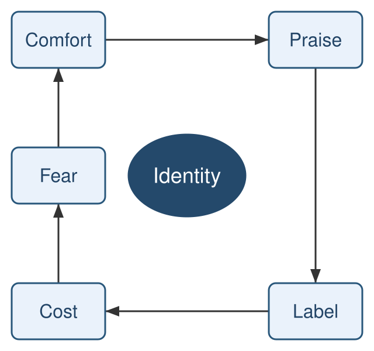
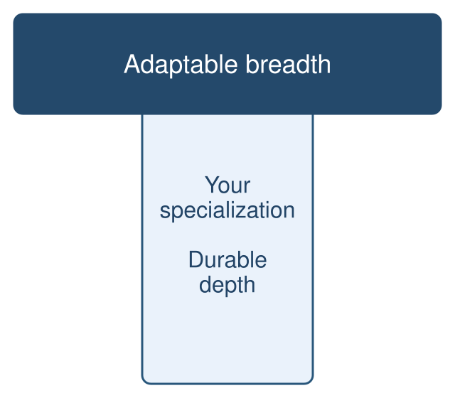
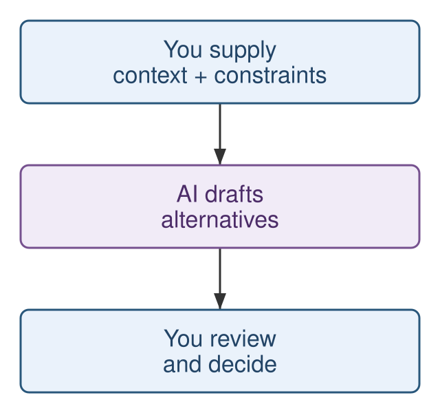
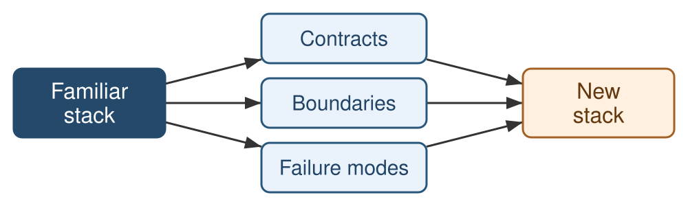

# Refactoring Your Identity

Keep your expertise. Expand where it works.

### Chris Ayers

<!--
Allow about 60 minutes, excluding Q&A. Keep section breaks brief and protect
time for the three stories, reflection, and worked example.
Refactoring keeps useful behavior while changing structure. Here, keep your
hard-won strengths while changing the limits you place around them.
-->

---

## Chris Ayers

_Principal Software Engineer_\
_Azure EngOps AzRel_\
_Microsoft_

<i class="fa-brands fa-bluesky"></i> Bluesky: [@chris-ayers.com](https://bsky.app/profile/chris-ayers.com)
<i class="fa-brands fa-linkedin"></i> LinkedIn: [chris\-l\-ayers](https://linkedin.com/in/chris-l-ayers/)
<i class="fa fa-window-maximize"></i> Blog: [https://chris-ayers\.com/](https://chris-ayers.com/)
<i class="fa-brands fa-github"></i> GitHub: [Codebytes](https://github.com/codebytes)
<i class="fa-brands fa-mastodon"></i> Mastodon: [@Chrisayers@hachyderm.io](https://hachyderm.io/@Chrisayers)
~~<i class="fa-brands fa-twitter"></i> Twitter: @Chris_L_Ayers~~

---

# 🧵 Coding Kata Meetup

> I'm not a ____________ developer. I'm a XXXXXXXXXXXX Developer.

_I'm stack-agnostic. As long as it's my stack._

<!--
The blanks and Xs are intentional talk-track prompts. Keep them.
Tell the actual meetup exchange and supply the technologies aloud. Pause
before the second label. The italic line is an optional joke about a shared
reflex, not an additional quotation from the attendee.
What useful idea could someone take from the exercise despite unfamiliar
syntax? Make the restrictive habit the target, not a language community.
-->

---

<!-- _class: invert -->

# <!-- fit --> Who are you?

Have you ever passed on work because you weren't **"that kind" of developer?**

<!--
Pause and let people recall a moment. No public disclosure is required.
Keep this about technical identity, not a judgment of someone's whole identity.
A language or framework is useful shorthand until it decides which work
someone is willing to consider.
-->

---

# <i class="fa-solid fa-seedling" aria-hidden="true"></i> One Strength. One Experiment.

* Find a skill you can use somewhere unfamiliar
* Choose one small experiment for the next 30 days
* Leave with a five-line record you can reuse

<!--
Make the audience promise explicit. They already have experience to draw on;
they do not have to start from nothing. Curiosity and a record of what happened
help them reuse the learning. Familiarity saves time, but it can also stop us
considering another approach. Discomfort is not a character flaw.
-->

---

<!-- _class: invert -->

# <!-- fit --> How did we get here?

<!-- Return to the kata moment. Why would a useful technology become a limit? -->

---

# <i class="fa-solid fa-circle-nodes" aria-hidden="true"></i> How Technical Identity Forms

* Early wins build confidence
* You get faster and receive praise
* Work comes back to **"The Expert"**
* Repetition builds comfort and narrows your range

<!--
Walk through the feedback loop. Getting good at a kind of work is useful.
At "The Expert", use the aside:
"You fix one YAML file, and suddenly you're the YAML person. There is no appeal."
Pause before "There is no appeal", then return to the loop.
Praise and repeat assignments reinforce the label; the perceived cost of
change and fear of losing status can send us back to familiar work.
The restriction appears when we or others assume it is the only work we can do.
-->

---

# <i class="fa-solid fa-stethoscope" aria-hidden="true"></i> When a Label Makes the Choice

## Tool first

Pick the familiar solution before considering the requirements.

## Status first

Avoid work where someone might see you need help.

## Comfort first

Rule out an opportunity because it is outside your stack.

<!--
Bring these signs back to the meetup and the audience's own recollections:
What belief was I protecting? What experiment did I avoid? What did that
choice tell the people around me?
Introducing yourself mainly through a tool can reinforce the same pattern.
Choosing a known tool can be sensible; the warning is choosing it before
considering the problem. Constraints and available support matter too.
-->

---

# <i class="fa-solid fa-arrow-down" aria-hidden="true"></i> Depth Is Not the Problem

* Keep your specialization
* Make room for work outside it
* Think **T-shaped**: deep expertise with room to branch out

<!-- Speaker Note: Expertise takes years. The goal is to use that depth in more situations, not become equally good at everything. -->

---

# Range & Generalists

- David Epstein's *Range* makes the case for breadth in complex, changing work
- Experience elsewhere can help you recognize a useful pattern
- Build on your depth while trying something outside it

<!--
Keep this beside the depth discussion, not between the skill map and its
application. The book is not a rule that everyone should generalize equally.
Specialization still matters; the question is where else it can help.
-->

---

# <i class="fa-solid fa-clipboard-list" aria-hidden="true"></i> Pick One Example to Carry Forward

| Write down | Your example |
| --- | --- |
| One avoided area | A stack, domain, or kind of work |
| One concern | Time, status, uncertainty, or needing help |
| One existing strength | Something you could bring to that work |

**Keep this note. We will turn it into an experiment.**

<!--
Give people time to write. If they need a starting point, ask about the last
time they shipped in an unfamiliar stack or a decision where comfort
influenced the choice. They do not need three examples or a public confession.
Return to this same note at the trigger discussion, skill map, and closing.
-->

---

# Share & Normalize (Optional)

* Share one area you've avoided
* Listen for a pattern you recognize
* Keep the personal parts private if you prefer

<!--
Take a few volunteers or use a show of hands. Keep this brief if time is tight.
Listening for shared patterns can normalize discomfort without requiring
anyone to disclose concerns about status or competence. The experiment comes
later; for now, keep the same example.
-->

---

<!-- _class: invert -->

# <!-- fit --> Refactor Your Identity
# *Before* It Hardens

<!-- Speaker Note: It is easier to try unfamiliar work before a role change forces the issue. -->

---

# <i class="fa-solid fa-lock" aria-hidden="true"></i> What Repetition Can Cost

## Fewer possibilities

- The familiar choice becomes the default
- You get less practice comparing approaches

## Less room to learn

- Maintenance can fill the available time
- Defending a niche can become exhausting

<!--
The cost may be an opportunity you never hear about or quietly rule out.
Repetition limits exposure to other problems, but maintenance is necessary
work, not a personal failure. Time, staffing, and training support affect
which experiments are possible.
Judgment is also hard to see when nobody knows why a choice was made.
A short decision record can make learning visible without another reporting job.
-->

---

# 🧵 My Re-Org: FTA to AzRel

## Customer architecture

- Help customers adopt Azure
- Design and build cloud-native solutions

## Reliability engineering

- Learn risks, outages, and new tools
- Build AI-assisted analysis with other teams

**New context. Existing habits: ask, map, explain.**

<!--
Use the actual FTA-to-AzRel transition, documented at
https://chris-ayers.com/posts/new-team-new-focus/ and
https://chris-ayers.com/posts/promoted-to-principal-swe/.
The role changed from customer architecture to reliability risks and outage
analysis, including tooling with OpenAI and Semantic Kernel.
After showing the change in roles:
"New team. New problems. A whole new set of acronyms to confidently nod at."
Brief pause, then describe what you actually needed to learn.
Tell a personally accurate moment of uncertainty, a choice you made, and what
changed afterward. Do not invent an outcome, metric, or colleague's reaction.
Focus on what you had to learn and which habits you could reuse, not which
people were supposedly the strongest coders or fastest to adapt.
-->

---

<!-- _class: invert -->

# <!-- fit --> Refactor Your Identity *Intentionally*

<!-- Speaker Note: Move from recognizing the pattern to changing a decision at the moment it happens. -->

---

# <i class="fa-solid fa-triangle-exclamation" aria-hidden="true"></i> Trigger Moments to Watch For

**<i class="fa-solid fa-bolt" aria-hidden="true"></i> You feel slower**

* Is the work unfamiliar, or is the approach wrong?

**<i class="fa-solid fa-compass" aria-hidden="true"></i> The problem is unclear**

* Are you picking a tool before asking enough questions?

**<i class="fa-solid fa-shield-halved" aria-hidden="true"></i> Risk gets deferred**

* Are you forcing old patterns into a different context?

<!--
Return to the concern people wrote down. Which trigger would they notice
in that situation? Feeling slower can be part of learning; it is still worth
checking whether the approach fits. Bring quality and operating constraints
into the discussion early.
-->

---

# Small Interventions at the Moment of Choice

* Spend 2 minutes considering another option
* Ask what has changed since the last decision
* Choose the smallest useful experiment
* Capture one decision in 5 lines

<!--
Keep these small enough to use in a real meeting. A brief pause or note is
more useful than a process nobody has time to follow. We will show a complete
five-line record in the worked example.
Bridge to AI: that two-minute pause matters even more when an assistant can
produce a plausible answer in seconds.
-->

---

# <i class="fa-solid fa-wand-magic-sparkles" aria-hidden="true"></i> AI Lowers the Cost of Trying

* Map unfamiliar code before editing it
* Compare patterns with what you already know
* Try a small change you can explain and test

<!--
Routine code can be produced quickly, so memorizing syntax and APIs becomes
less of an advantage. A fluent answer can still misunderstand the problem.
Be direct about that pressure without predicting which jobs disappear.
Use saved time to explore alternatives, design, and review. The opportunity
is to learn in an unfamiliar context, not accept whatever is generated.
Ask how an unfamiliar pattern relates to one you know, but check where the
analogy breaks. A plausible answer is not a decision. Use approved tools and
only code you are allowed to share; do not supply secrets or customer records.
-->

---

# 🦆 My Rubber Duck Has Opinions Now

## Give it context

- The problem and constraints
- What an acceptable result looks like

## Challenge the answer

- Alternatives and failure cases
- Evidence that the result works

**Direct AI. Don't just use it.**

<!--
Let the title supply one light beat, then return to the point. Explaining a
problem is useful before any answer arrives. The duck now talks back, but
its confidence is not evidence. Review the result and own the decision.
Source: https://chris-ayers.com/posts/copilot-or-rubber-ducky/.
-->

---

# <i class="fa-solid fa-user-shield" aria-hidden="true"></i> What You Still Own

* Deciding which problem to solve
* Choosing trade-offs under real constraints
* Checking whether the output is correct and safe
* Getting people to agree on a direction

**If you cannot explain the change, keep investigating.**

<!--
Callback to the previous slide:
"The rubber duck has opinions. It doesn't carry the pager."
Pause, then connect the joke to reviewing the result and owning the decision.
Keep this about responsibility, not a claim about what AI will never do.
Read the diff and run checks against the actual requirements. Generated tests
can repeat the same wrong assumption as generated code. Decide what an agent
may read, change, or execute rather than handing it unrestricted access.
The context you give the assistant exposes what you know beyond syntax.
These are the same capabilities that help when changing stacks.
-->

---

# <i class="fa-solid fa-map" aria-hidden="true"></i> Ask for a Map Before a Patch

_Example: a form in an unfamiliar codebase._

> Trace the Save action from the form to the API. Cite the files you used.
>
> Separate observations from assumptions. Suggest the smallest check for each uncertainty.
>
> Don't change code yet.

**Read the code. Run the checks. Explain the result.**

<!--
This is an illustrative request, not a claim that an assistant inspected a
real project. Give it authorized access to the relevant code; without that
context it should ask for the missing files, not invent a path through the app.
Open the cited code yourself and check the proposed explanation. Run an
appropriate check or experiment instead of treating a confident answer as proof.
The prompt makes your existing skills visible: boundaries, evidence, and
knowing what would disprove an assumption. The payoff is understanding you
can reuse, not just a patch you cannot explain.
Bridge to the cross-stack story: those habits help with unfamiliar work
whether or not an AI assistant is involved.
-->

---

<!-- _class: invert -->

# <!-- fit --> Refactor Your Identity *For Growth*

<!-- Ask what travels into another stack or role. Start with the story, not a list. -->

---

# 🧵 Cross-Stack Win

_Backend habits. Front-end problem._

> The stack was unfamiliar. The thinking was portable.

<!--
Tell the existing cross-stack story: a systems design habit from backend work,
including contracts, boundaries, and failure modes, helped a struggling
front-end team. Describe the real situation, your reasoning, the action, and
the observable result, using only details you can stand behind.
Do not repeat the skill list. Show the specific habit that helped.
The following form example is an explicitly illustrative exercise, not a
newly asserted detail of this anecdote.
-->

---

# A Contact Saved Twice

_Example: you're new to the team's UI framework._

1. A user enters a contact and clicks **Save**.
2. No confirmation appears. They click **Save** again.
3. The contact appears **twice** in the list.

**A retry should not create a second record.**

<!--
This is a hypothetical teaching example, not an account of Chris's project.
The user wants to save one contact, not create a second one. You are helping
investigate even though the UI framework is unfamiliar.
Separate observation from explanation: we saw no confirmation, another click,
and duplicate contacts. We do not yet know whether both clicks sent requests,
a request was retried automatically, or one request was processed twice.
The later lost-response experiment tests a possible failure mode; it is not
proof of what happened here. A missing confirmation does not prove a save failed.
For the exercise, assume the team can change both the UI and API. Mention this
when comparing the options, rather than making it the main point of the setup.
Ask: "What useful questions can you already ask without knowing this framework?"
-->

---

# <i class="fa-solid fa-map" aria-hidden="true"></i> Three Questions. Eight Portable Skills.

## Judgment

What fits the outcome?

Systems design\
Business value\
Trade-offs

## Investigation

What does the evidence say?

Problem solving\
Debugging discipline\
Quality & governance

## Shared impact

Who can use the reasoning?

Communication\
Mentorship & leadership

<!--
Give the map briefly. These are the original portable pillars, grouped by
what they help us do. "Problem solving" includes reframing and root-cause
analysis. The framework is a way to follow the case, not another taxonomy
to memorize. Ask people to notice the strength they chose in their reflection.
-->

---

# <i class="fa-solid fa-diagram-project" aria-hidden="true"></i> Judgment: What Must Stay True?

**Customer outcome: one record for one intended submission.**

| Boundary | Contract |
| --- | --- |
| Intent and retry | Same intent, same operation key |
| API and storage | Enforce one result for that operation |
| Result and UI | A timeout is not proof of failure |

<!--
Business value gives the design something to satisfy. Identify actors,
boundaries, and contracts; trace the data rather than starting with a favorite
framework. These questions transfer across customer, platform, and community work.
For this illustrative design, a retry must reuse the same operation key and
the server must enforce the contract. A new intended submission is a new
operation. Compare the benefit with the effort and operating constraints.
The key is not magic: scope, concurrency, storage, and failure handling matter.
-->

---

# <i class="fa-solid fa-scale-unbalanced" aria-hidden="true"></i> Trade-Offs: Which Fix Fits?

## Disable the button

- Improves feedback during a request
- Does not make network retries safe

## Enforce idempotency

- Protects retries of the same operation
- Adds server-side state and policy

**Which protects a retry after a lost response?**

<!--
Pause for a choice and a reason before the aside:
"We disabled the button. The network did not get the memo."
Then explain why these are complementary, not mutually
exclusive: UI feedback helps people; a server-enforced operation key protects
retries. The earlier assumption that both UI and API can change matters.
Discuss the cost of operating and changing the solution, including key
lifetime, consistent payloads, and concurrent requests. The UI must reuse
the key for the same intent. Never treat a client-supplied key as authorization.
Which decisions are reversible? An expensive-to-undo choice deserves more
care than a reversible experiment. Explain constraints rather than a favorite tool.
-->

---

# <i class="fa-solid fa-bug-slash" aria-hidden="true"></i> Investigation: Follow the Evidence

* **Hypothesis:** one intent reached the write path twice
* **Evidence:** correlate operation keys, requests, and writes
* **Experiment:** delay the response after a write, then retry

**What would distinguish a double-click from a network retry?**

<!--
Reframe "the new UI framework is broken" into a question about intent,
requests, and side effects. This combines structured problem solving with
debugging discipline: reproduce, follow evidence, and look for root causes.
The controlled experiment probes a failure mode; it does not prove that this
was the cause of the original observation. What result would disprove the
hypothesis? Separate what was observed from what is only an explanation.
Revisit earlier assumptions and use the decision history during investigation.
-->

---

# <i class="fa-solid fa-sitemap" aria-hidden="true"></i> Make the Failure Safe and Visible

## Before rollout

Exercise timeouts, retries, and concurrent requests.

## At the boundary

Authorize the caller. Scope keys to the caller and operation.

## After rollout

Observe duplicate attempts, successes, and failures.

<!--
Quality and governance follow the application across stacks. Automate delivery
and watch its results; address security early and use least privilege; make
failures visible through observability. Use the concern that matters to this
example rather than teaching all of delivery, DORA, security, and observability.
The original delivery and DORA examples can support questions in the talk track.
Do not put sensitive payloads into logs or let an operation key bypass
authorization. A successful happy-path test does not settle failure behavior.
-->

---

# <i class="fa-solid fa-comments" aria-hidden="true"></i> Shared Impact: Leave the Reasoning

## Explain

- Check the shared meaning of "one submission"
- Explain the options, constraints, and decision

## Enable

- Share the reproduction and decision record
- Let someone else replay and challenge them

<!--
Communication and facilitation start with listening: "What I'm hearing is..."
Match the explanation to the person who needs to act. Use a diagram when it
explains more than prose, not as decoration.
Mentorship and leadership mean making room to learn, sharing reusable work,
and teaching the reasoning. In the consulting post:
"I want them to learn and apply it after I'm gone."
https://chris-ayers.com/posts/snake-oil-devops-beware/.
The practical outcome is what another person can do without asking you again.
-->

---

# <i class="fa-solid fa-file-lines" aria-hidden="true"></i> Five Lines Others Can Reuse

| Line | Record |
| --- | --- |
| Context | A retry can create a duplicate record. |
| Options | UI guard alone; server-enforced idempotency. |
| Criteria | Safe retries and an operable change. |
| Decision | Enforce idempotency; a UI guard alone misses retries. |
| Evidence to collect | One result under retries and concurrent requests. |

<!--
After introducing the five-line limit:
"Five lines. If it needs a table of contents, we've gone too far."
Brief pause, then walk through the record.
This is a worked example, not a claimed project outcome. The final line is
explicitly evidence still to collect. After the experiment, replace it with
what actually happened and what you learned.
The rejected option and reason are in the decision line. A five-line record
can capture context, options, criteria, a rejected alternative, and an outcome
without becoming a new reporting system. Keep it beside the work.
The skills combine here: customer context, systems boundaries, trade-offs,
investigation, and an explanation another person can use.
-->

---

# <i class="fa-solid fa-compass" aria-hidden="true"></i> Now Apply It to Your Example

## What stays?

The existing strength you wrote down.

## What changes?

The stack, domain, or kind of work.

## What will you try?

One small way to use that strength there.

**You do not need fluency before you can ask useful questions.**

<!--
Return to the same reflection note, not a new exercise. Give people time to
connect their strength to the avoided area. This is the point of the worked
example, not a request for everyone to learn idempotency.
Expect discomfort and judge progress by what was tried and learned.
"I don't know this yet" can become a next step rather than a reason to stop.
-->

---

<!-- _class: invert -->

# <!-- fit --> Refactor Your Identity *Continuously*

<!-- Speaker Note: Use the "one cup at a time" idea from your blog: make an improvement, look at the result, and make another. https://chris-ayers.com/posts/how-do-you-boil-the-ocean/ -->

---

# Start Where You Are

* Keep your current job; change what you practice
* Borrow a problem from your team, community, or open source
* Pick one small experiment for the next 30 days

<!--
A meetup, conference exercise, study group, or personal project can be a
low-risk place to start. Bring back the same area and strength from the
reflection. Bound the time and risk so the experiment fits the work and
support people actually have. They do not need to change jobs to begin.
-->

---

# <i class="fa-solid fa-calendar-day" aria-hidden="true"></i> Your 30-Day Focus

**Pick one starting action. Not all four.**

| Choose | Try |
| --- | --- |
| Notice a strength | Name a strength and somewhere new to use it. |
| Record a decision | Capture five lines beside the work. |
| Check an assumption | Clarify one in a meeting, 1:1, or study group. |
| Run an experiment | Try something unfamiliar; record what you learned. |

<!--
This is a menu, not four obligations. Choose a realistic starting point using
the reflection note. If a fuller inventory helps, list three strengths and
one growth target. A record can include context, options, criteria, a rejected
option, and the outcome. An experiment can involve a tool, language, or domain.
Put a date and a small time boundary on the chosen action. The record lives
beside the work, not in a new reporting system.
-->

---

# <i class="fa-solid fa-calendar-week" aria-hidden="true"></i> Your 60-Day Follow-On

**Extend the habit you started. Choose one follow-on.**

| Choose | Try |
| --- | --- |
| Review your balance | Pick an underused skill from the last month's work. |
| Combine strengths | Apply two skills to one real problem. |
| Teach something | Share for 10 minutes; keep two follow-up questions. |
| Review weekly | Notice what helped and adjust your next experiment. |

<!--
Use the second month to apply and share what was learned. Combining skills
can mean comparing options using constraints, a discussion, and a small
experiment. For a weekly review, note three moments where a skill helped
and what changed. Review the work people actually have, rather than requiring
an arbitrary number of documents or a complete improvement program.
-->

---

# Who Are You Beyond the Stack?

> I help **[people]** achieve **[outcome]**.\
> I bring **[portable strength]**.\
> Right now, I work in **[stack]**.

**Choose your experiment before you leave.**

<!--
These are intentional audience fill-in prompts, not unfinished copy.
Return to the opening question and let people rewrite their introduction.
They can keep their specialty without making it the boundary of their value.
Connect that strength to the avoided area and the one action they chose.
Keep the reflection private if preferred; ask for a decision, not a pledge
to finish every item on the two menus.
-->

---

<!-- _class: small -->

# Thank You

# Refactor Your Identity
## *Continuously.* Not Reactively.

One strength. One experiment.

### Resources

[*Range* - David Epstein](https://davidepstein.com/range/)\
[25 Transferable Skills Employers Look For](https://careerconnections.smeal.psu.edu/blog/2022/10/28/25-transferable-skills-employers-look-for/)

## Chris Ayers

_Principal Software Engineer_\
_Azure EngOps AzRel_\
_Microsoft_

<i class="fa-brands fa-bluesky"></i> Bluesky: [@chris-ayers.com](https://bsky.app/profile/chris-ayers.com)\
<i class="fa-brands fa-linkedin"></i> LinkedIn: [chris\-l\-ayers](https://linkedin.com/in/chris-l-ayers/)\
<i class="fa fa-window-maximize"></i> Blog: [https://chris-ayers\.com/](https://chris-ayers.com/)\
<i class="fa-brands fa-github"></i> GitHub: [Codebytes](https://github.com/codebytes)\
<i class="fa-brands fa-mastodon"></i> Mastodon: [@Chrisayers@hachyderm.io](https://hachyderm.io/@Chrisayers)
~~<i class="fa-brands fa-twitter"></i> Twitter: [@Chris_L_Ayers](https://twitter.com/Chris_L_Ayers)~~

<!-- Speaker Note: Close with the original message and one small experiment to try. Thank the audience and open for questions. -->