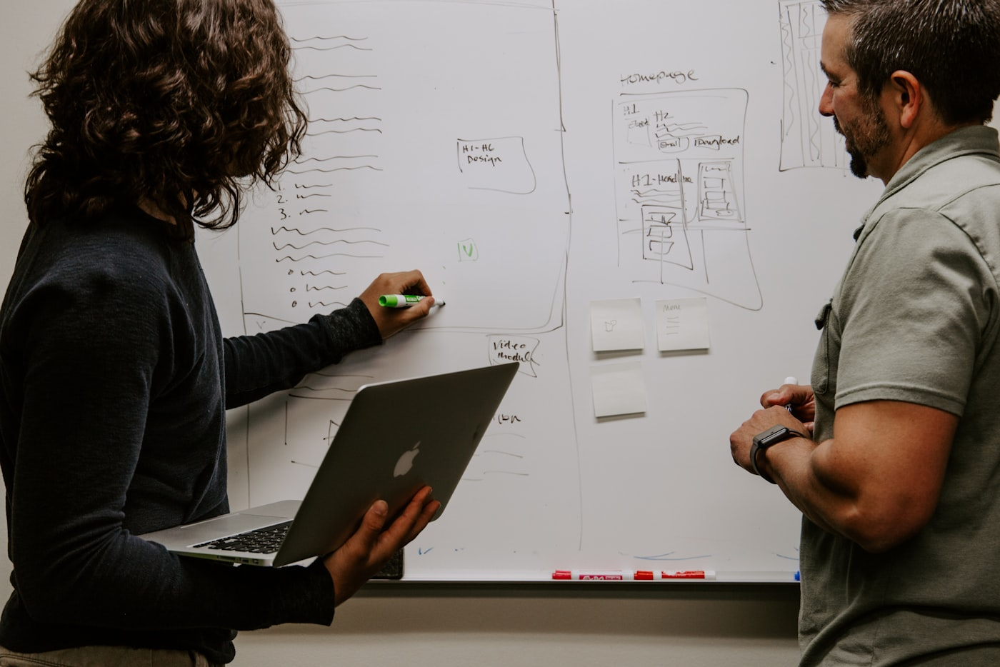
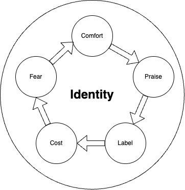
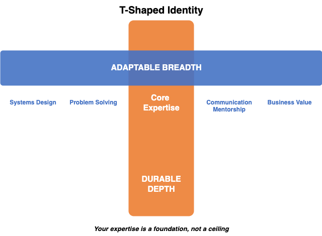
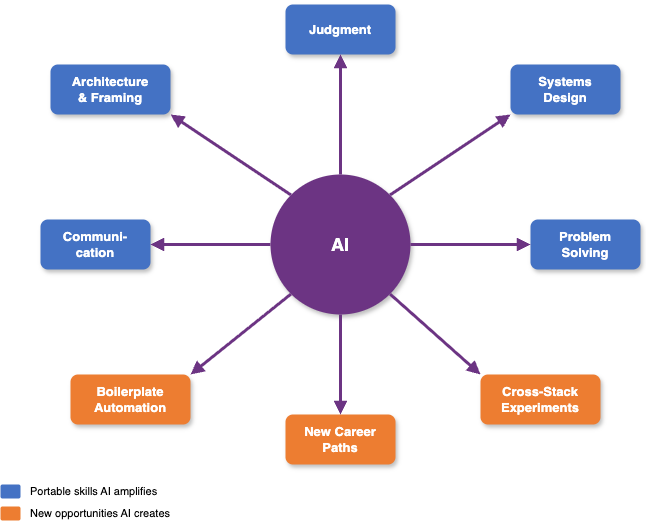
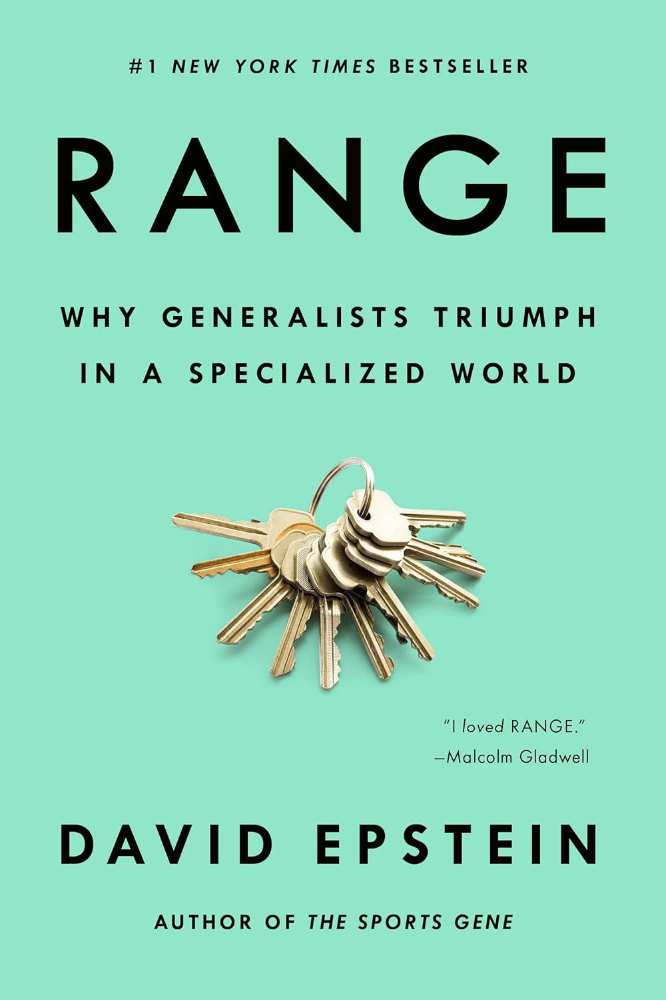
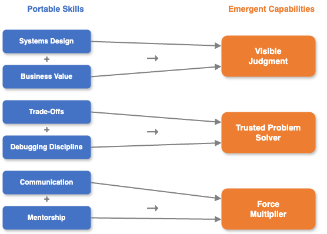
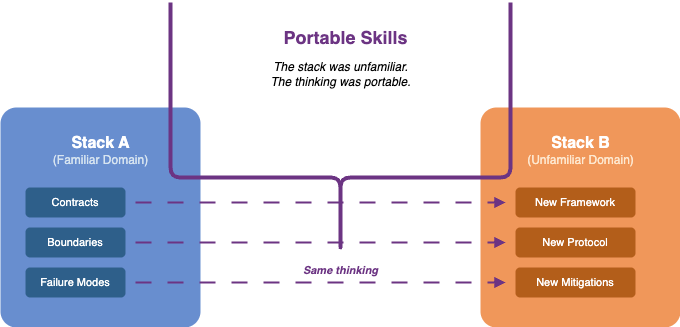

# Refactoring Your Identity

### Chris Ayers

<!--
Allow about 60 minutes, excluding Q&A. Keep the opening questions and section
breaks brief so there is time for the stories and reflection exercise.
-->

---

## Chris Ayers

_Principal Software Engineer_\
_Azure EngOps AzRel_\
_Microsoft_

<i class="fa-brands fa-bluesky"></i> Bluesky: [@chris-ayers.com](https://bsky.app/profile/chris-ayers.com)
<i class="fa-brands fa-linkedin"></i> LinkedIn: [chris\-l\-ayers](https://linkedin.com/in/chris-l-ayers/)
<i class="fa fa-window-maximize"></i> Blog: [https://chris-ayers\.com/](https://chris-ayers.com/)
<i class="fa-brands fa-github"></i> GitHub: [Codebytes](https://github.com/codebytes)
<i class="fa-brands fa-mastodon"></i> Mastodon: [@Chrisayers@hachyderm.io](https://hachyderm.io/@Chrisayers)
~~<i class="fa-brands fa-twitter"></i> Twitter: @Chris_L_Ayers~~

---

<!-- _class: invert -->

# <!-- fit --> Who are you?

<!-- Speaker Note: Pause here. Ask people to think beyond their job title or current stack. -->

---

# <!-- fit --> How do you define your technical identity?

Is it a language, a framework, or something broader?

<!-- Speaker Note: A technology label can be useful shorthand. Ask when it becomes a limit on the work someone will consider. -->

---

# <i class="fa-solid fa-lightbulb" aria-hidden="true"></i> Why It Matters

* Is your identity tied to a particular technology?
* Does unfamiliar work feel risky?
* Do you reach for the same solution every time?

<!-- Speaker Note: Familiarity saves time, but it can also keep us from considering a better approach. Let people recognize the pattern without treating discomfort as a character flaw. -->

---

# <i class="fa-solid fa-seedling" aria-hidden="true"></i> Or an Opportunity

* Your skills can transfer to other kinds of work
* Curiosity gives you reasons to try
* Recording decisions helps you reuse what you learn

<!-- Speaker Note: Keep the opportunity alongside the risk. The audience already has experience to draw on; they do not have to start from nothing. -->

---

# 🧵 Story Time

## Coding Kata Meetup 😅🧑‍💻

> I'm not a ____________ developer. I'm a XXXXXXXXXXXX Developer.

_Identity over exploration._

* Don't pass up a learning opportunity because of a label
* Look for useful ideas wherever you find them

<!--
Speaker Note: The blanks and Xs are intentional talk-track prompts. Keep them.
Tell the meetup exchange and supply the technologies aloud. Ask what someone
could learn from the exercise even with unfamiliar syntax.
-->

---

<!-- _class: invert -->

# <i class="fa-solid fa-user-gear" aria-hidden="true"></i> How did we get here?

<!-- Speaker Note: Move from the meetup story to the habits that make a technology feel like part of who we are. -->

---

# <i class="fa-solid fa-circle-nodes" aria-hidden="true"></i> How Technical Identity Forms

* Early wins build confidence
* You get faster and receive praise
* Work comes back to **"The Expert"**
* Repetition builds comfort and narrows your range

<!-- Speaker Note: Walk through the feedback loop. Getting good at a kind of work is useful; the restriction appears when everyone assumes it is the only work you can do. -->

---

# Deconstructing That Moment

* What belief was I protecting? ("I'm a _____ Developer.")
* What experiment did I avoid?
* What did that choice tell the people around me?

<!-- Speaker Note: Bring the questions back to the meetup. Invite people to recall a similar moment of their own. -->

---

# <i class="fa-solid fa-stethoscope" aria-hidden="true"></i> Identity Warning Signs

* Introduce yourself mainly through a tool or stack
* Choose familiar tools before considering the requirements
* Avoid work where you'd need help

<!-- Speaker Note: Ask which behavior feels familiar. Choosing a known tool can be sensible; the warning is choosing it before considering the problem. -->

---

# <i class="fa-solid fa-arrow-down" aria-hidden="true"></i> Depth Is Not the Problem

* Keep your specialization
* Make room for work outside it
* Think **T-shaped**: deep expertise with room to branch out

<!-- Speaker Note: Expertise takes years. The goal is to use that depth in more situations, not become equally good at everything. -->

---

# <i class="fa-solid fa-clipboard-list" aria-hidden="true"></i> Identity Reflection Exercise

* List 3 tech areas you tend to avoid
* Recall the last time you shipped in an unfamiliar stack
* Name a decision where comfort influenced your choice
* What worried you? Status, time, or being seen to struggle?

<!-- Speaker Note: Give people time to write. They do not have to share the personal parts. Choose one example to return to when discussing a small experiment. -->

---

# Share & Normalize (Optional)

* Share one area you've avoided
* Listen for a pattern you recognize
* Choose one small experiment you'd be willing to try

<!-- Speaker Note: Take a few volunteers, or use a show of hands. Keep this brief if time is tight; the reflection can remain private. -->

---

<!-- _class: invert -->

# <!-- fit --> Refactor Your Identity
# *Before* It Hardens

<!-- Speaker Note: It is easier to try unfamiliar work before a role change forces the issue. -->

---

# <i class="fa-solid fa-lock" aria-hidden="true"></i> Identity Lock-In & Opportunity Loss

* Repeating the same work limits exposure to other problems
* The familiar choice becomes the default
* You get less practice comparing approaches

<!-- Speaker Note: The cost is often an opportunity you never hear about or consider. Ask what work people have quietly ruled themselves out of. -->

---

# <i class="fa-solid fa-shield-halved" aria-hidden="true"></i> Career Longevity & Energy Risks

* Maintenance fills the time you could spend learning
* Your judgment is hard to see if nobody knows why you made a choice
* Defending a niche can become exhausting

<!-- Speaker Note: Connect the career concern to everyday work. A short record of a decision can make learning and judgment visible without creating another reporting job. -->

---

# 🧵 Story Time

## Team Re-Org 🔄🧩🤝💭

> After the re-org, half the team clung to their old titles and tooling.
> The ones who adapted fastest weren't the strongest coders —
> they were the ones who could map old patterns to new contexts.

_Identity over role._ Lock-In 🔐 vs Growth 🌱

<!-- Speaker Note: Tell the re-org story and describe what changed about the work. Your FTA-to-AzRel move is documented at https://chris-ayers.com/posts/new-team-new-focus/. Focus on the habits that helped with the transition. -->

---

<!-- _class: invert -->

# <!-- fit --> Refactor Your Identity *Intentionally*

<!-- Speaker Note: Move from recognizing the pattern to changing a decision at the moment it happens. -->

---

# <i class="fa-solid fa-triangle-exclamation" aria-hidden="true"></i> Trigger Moments to Watch For

**<i class="fa-solid fa-bolt" aria-hidden="true"></i> You feel slower**

* Is the work unfamiliar, or is the approach wrong?

**<i class="fa-solid fa-compass" aria-hidden="true"></i> The problem is unclear**

* Are you picking a tool before asking enough questions?

**<i class="fa-solid fa-shield-halved" aria-hidden="true"></i> Risk gets deferred**

* Are you forcing old patterns into a different context?

<!-- Speaker Note: These are moments to pause. Feeling slower can be part of learning; it is still worth checking whether the approach fits. Bring quality and operating constraints into the discussion early. -->

---

# Small Interventions at the Moment of Choice

* Spend 2 minutes considering another option
* Ask what has changed since the last decision
* Choose the smallest useful experiment
* Capture one decision in 5 lines

<!-- Speaker Note: Keep these small enough to use in a real meeting. A brief pause or note is more useful than a process nobody has time to follow. -->

---

<!-- _class: invert -->

# <!-- fit --> Refactor Your Identity in the *Age of AI*

<!-- Speaker Note: AI makes this question more immediate. Routine implementation is easier to generate, and evaluating the result requires more than knowing the syntax. -->

---

# <i class="fa-solid fa-robot" aria-hidden="true"></i> Where AI Applies Pressure

* AI can produce routine code quickly
* A fluent answer can still misunderstand the problem
* Memorizing syntax and APIs becomes less of an advantage

<!-- Speaker Note: Be direct about the pressure on routine implementation without predicting which jobs disappear. Knowing what to build and whether it works remains part of the job. -->

---

# <i class="fa-solid fa-wand-magic-sparkles" aria-hidden="true"></i> AI as Opportunity & Amplifier

* Explore code in an unfamiliar stack
* Use a draft to get an experiment started
* Spend the saved time on design and reviewing the result

<!-- Speaker Note: AI can lower the cost of trying something unfamiliar. The useful part is the chance to learn and compare approaches, not accepting whatever it produces. -->

---

# <i class="fa-solid fa-user-shield" aria-hidden="true"></i> What You Still Own

* Deciding which problem to solve
* Choosing trade-offs under real constraints
* Checking whether the output is correct and safe
* Getting people to agree on a direction

<!-- Speaker Note: Keep this about responsibility, not a claim about what AI will never do. These are the same skills that help when changing stacks. -->

---

# <i class="fa-solid fa-compass-drafting" aria-hidden="true"></i> Direct AI, Don't Just Use It

* Give it context, constraints, and acceptance criteria
* Ask for alternatives and challenge the answer
* Review the result and own the decision

<!-- Speaker Note: The rubber-duck comparison can help here: explaining the problem is useful before any answer arrives. See https://chris-ayers.com/posts/copilot-or-rubber-ducky/. -->

---

<!-- _class: invert -->

# <!-- fit --> Refactor Your Identity *For Growth*

<!-- Speaker Note: Turn to the skills people can carry into another stack or role. -->

---

# <i class="fa-solid fa-map" aria-hidden="true"></i> The Portable Pillars at a Glance

- <i class="fa-solid fa-diagram-project" aria-hidden="true"></i> **Systems design**
- <i class="fa-solid fa-bullseye" aria-hidden="true"></i> **Business value**
- <i class="fa-solid fa-scale-unbalanced" aria-hidden="true"></i> **Trade-offs**
- <i class="fa-solid fa-puzzle-piece" aria-hidden="true"></i> **Problem solving**

- <i class="fa-solid fa-bug-slash" aria-hidden="true"></i> **Debugging discipline**
- <i class="fa-solid fa-comments" aria-hidden="true"></i> **Communication**
- <i class="fa-solid fa-sitemap" aria-hidden="true"></i> **Quality & governance**
- <i class="fa-solid fa-user-group" aria-hidden="true"></i> **Mentorship & leadership**

<!-- Speaker Note: Give the audience the map, then move on. Ask them to notice one strength and one skill they want more practice using. -->

---

# Range & Generalists

- David Epstein's *Range* makes the case for breadth in complex, changing work
- Experience in another field can help you recognize a useful pattern
- Build on what you know while trying something outside it

<!-- Speaker Note: Connect the book to the talk without treating generalization as a rule for every career. Depth still matters. -->

---

# <i class="fa-solid fa-diagram-project" aria-hidden="true"></i> Systems Design

- Identify boundaries, actors, and contracts
- Trace the data and record the decisions
- Recognize familiar failure modes in a different stack

<!-- Speaker Note: The framework may change while the questions about boundaries and failure remain useful. Use an example from the talk track rather than explaining every architecture term. -->

---

# <i class="fa-solid fa-bullseye" aria-hidden="true"></i> Business Value

- Understand what the customer needs
- Define what an improvement would look like
- Compare the benefit with the effort

<!-- Speaker Note: Bring the tool discussion back to the people using the result. The same questions apply in customer work, platform work, and a community project. -->

---

# <i class="fa-solid fa-scale-unbalanced" aria-hidden="true"></i> Trade-Offs

- Compare options against the constraints
- Include the cost of operating and changing them
- Know which decisions are easy to reverse

<!-- Speaker Note: A reversible choice does not need the same process as one that is expensive to undo. Explain the trade-off rather than presenting a favorite tool as the answer. -->

---

# <i class="fa-solid fa-puzzle-piece" aria-hidden="true"></i> Structured Problem Solving

- Reframe the problem before choosing a solution
- Look for root causes
- Consider how a fix could fail

<!-- Speaker Note: A short diagram or decision record makes the reasoning easier for someone else to follow. -->

---

# <i class="fa-solid fa-bug-slash" aria-hidden="true"></i> Debugging Discipline

- Form a hypothesis
- Reproduce the failure and follow the evidence
- Run the smallest test that could prove you wrong

<!-- Speaker Note: Knowing how to investigate is useful before you know every API. Separate what you observed from what you think explains it. -->

---

# <i class="fa-solid fa-comments" aria-hidden="true"></i> Communication & Facilitation

- Check assumptions: **"What I'm hearing is..."**
- Explain the options, constraints, and recommendation
- Use a diagram when it explains more than prose

<!-- Speaker Note: Listen before settling on an interpretation. Match the explanation to the person who needs to act on it. -->

---

# <i class="fa-solid fa-sitemap" aria-hidden="true"></i> Cross-Cutting Quality & Governance

- Automate delivery and watch its results
- Address security early; use least privilege
- Make failures visible through observability

<!-- Speaker Note: Keep the original delivery, DORA, security, and observability examples in the talk track. These concerns follow the application across stacks. -->

---

# <i class="fa-solid fa-user-group" aria-hidden="true"></i> Mentorship and Leadership

- Make room for people to learn
- Explain the reasoning behind your choices
- Share work that others can reuse

<!-- Speaker Note: In your consulting post: "I want them to learn and apply it after I'm gone." Use that practical test of a handoff. https://chris-ayers.com/posts/snake-oil-devops-beware/ -->

---

# Connecting the Pillars: Judgment

- Combine systems design with business value
- Explain why the design fits the customer's needs
- Make the trade-offs visible

<!-- Speaker Note: Use the diagram to show how skills work together. A design becomes easier to judge when its choices are connected to a specific outcome. -->

---

# Connecting the Pillars: Problem Solving

- Combine trade-offs with debugging
- Revisit the assumptions when something breaks
- Use the decision history to guide the investigation

<!-- Speaker Note: The earlier constraints help explain why a choice was made and when it needs to change. -->

---

# Connecting the Pillars: Impact

- Combine communication with mentorship
- Leave enough context for others to use your work
- Teach how you reached the decision

<!-- Speaker Note: Focus on what another person can do afterward. Reusable explanations save people from needing the same help repeatedly. -->

---

# 🧵 A Different Story

## Cross-Stack Win 🌉✨

> A systems design habit from backend work — contracts, boundaries, failure modes —
> turned out to be exactly what a struggling front-end team needed.
> The stack was unfamiliar. The thinking was portable.

_Portable skills compound across contexts._

<!-- Speaker Note: Tell the cross-stack example. Spend time on the habit that helped and how it was applied, rather than repeating the list of skills. -->

---

<!-- _class: invert -->

# <!-- fit --> Refactor Your Identity *Continuously*

<!-- Speaker Note: Use the "one cup at a time" idea from your blog: make an improvement, look at the result, and make another. https://chris-ayers.com/posts/how-do-you-boil-the-ocean/ -->

---

# <i class="fa-solid fa-brain" aria-hidden="true"></i> Adapting to Change and a Growth Mindset

* Expect some discomfort while learning
* Judge progress by what you've tried and learned
* Say **"I don't know this yet"** and choose a next step

<!-- Speaker Note: Return to the reflexes from earlier. Treat discomfort as something to examine, not an automatic reason to stop. -->

---

# Start Where You Are

* Keep your current job; change what you practice
* Borrow a problem from your team, community, or open source
* Pick one small experiment for the next 30 days

<!-- Speaker Note: A meetup, conference exercise, study group, or personal project can be a low-risk place to start. Bring back the example people chose in the reflection exercise. -->

---

# <i class="fa-solid fa-calendar-day" aria-hidden="true"></i> 30-Day Focus (Skill Awareness & Practice)

| Action Item | Description |
| --- | --- |
| <i class="fa-solid fa-magnifying-glass-chart" aria-hidden="true"></i> Skill Inventory | List 3 strengths and 1 growth target you can practice. |
| <i class="fa-solid fa-file-circle-plus" aria-hidden="true"></i> Decision Record | Capture context, options, criteria, a rejected option, and the outcome. |
| <i class="fa-solid fa-handshake-simple" aria-hidden="true"></i> Clear Communication | Check shared assumptions in a meeting, 1:1, or study group. |
| <i class="fa-solid fa-seedling" aria-hidden="true"></i> Small Experiment | Try an unfamiliar tool, language, or domain. Write 5 lines about what you learned. |

<!-- Speaker Note: Choose a realistic starting point. The record can live beside the work; it does not need a new reporting system. -->

---

<!-- _class: small -->

# <i class="fa-solid fa-calendar-week" aria-hidden="true"></i> 60-Day Focus (Application & Sharing)

| Action Item | Description |
| --- | --- |
| <i class="fa-solid fa-scale-balanced" aria-hidden="true"></i> Balance Audit | Review work from the past 30 days. Choose an underused skill to practice. |
| <i class="fa-solid fa-diagram-project" aria-hidden="true"></i> Combine Skills | Compare options for a real problem using constraints, a discussion, and a small experiment. |
| <i class="fa-solid fa-user-graduate" aria-hidden="true"></i> Teach Something | Share a skill for 10 minutes. Capture 2 follow-up questions. |
| <i class="fa-solid fa-clipboard-list" aria-hidden="true"></i> Weekly Review | Note 3 moments where a skill helped and what changed. |

<!-- Speaker Note: Use the second month to apply and share what you learned. Review the work you actually have, rather than aiming for an arbitrary number of documents. -->

---

<!-- _class: small -->

# Thank You

# Refactor Your Identity *Continuously*
## Not Reactively

## Chris Ayers

_Principal Software Engineer_\
_Azure EngOps AzRel_\
_Microsoft_

<i class="fa-brands fa-bluesky"></i> Bluesky: [@chris-ayers.com](https://bsky.app/profile/chris-ayers.com)\
<i class="fa-brands fa-linkedin"></i> LinkedIn: [chris\-l\-ayers](https://linkedin.com/in/chris-l-ayers/)\
<i class="fa fa-window-maximize"></i> Blog: [https://chris-ayers\.com/](https://chris-ayers.com/)\
<i class="fa-brands fa-github"></i> GitHub: [Codebytes](https://github.com/codebytes)\
<i class="fa-brands fa-mastodon"></i> Mastodon: [@Chrisayers@hachyderm.io](https://hachyderm.io/@Chrisayers)
~~<i class="fa-brands fa-twitter"></i> Twitter: [@Chris_L_Ayers](https://twitter.com/Chris_L_Ayers)~~

<!-- Speaker Note: Close with the original message and one small experiment to try. Thank the audience and open for questions. -->
